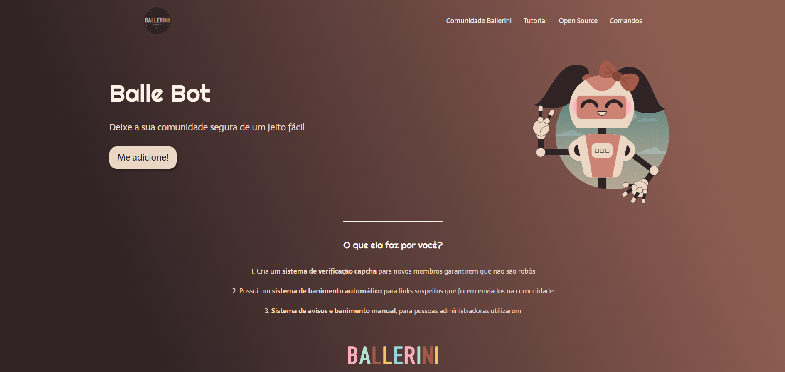

# 🚀 Landing Page - Balle Bot


Uma landing page simples e responsiva criada como projeto de prática com HTML e CSS. Inspirada em um bot de moderação para comunidades do Discord — o **Balle Bot** 🤖.

---

## 📸 Demonstração

  


---

## 🧰 Tecnologias utilizadas

- 🔹 HTML5  
- 🔹 CSS3  
- 🔹 Google Fonts  
- 🔹 Flexbox

---

## 📁 Estrutura de pastas

```bash
LandingPageTest/
│
├── index.html         # Estrutura da página
├── style.css          # Estilos e layout
├── logo.svg           # Logo principal
├── footer.svg         # Imagem do rodapé
└── README.md          # Documentação do projeto
